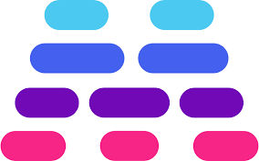

<!-- REPO TITLE -->
<br />
<p align="center">
  <a href="#">
    
  </a>

  <h4 align="center">Maybe | UI Engineer Coding Challengue</h4>
  <p align="center">
    <a href="https://company.maybe.co/UI-Engineer-Coding-Challenge-948982a2df7d40b7b4e15738448be529">Details</a>
    ·
    <a href="https://www.figma.com/file/tnG8TpHOYgyXSedzCxFCLs/Frontend-Coding-Challenge?node-id=0%3A1">Figma</a>
    ·
    <a href="https://www.loom.com/share/f37889ae9e024bcfaf9dcfbeffddfd09">Video</a>
  </p>
</p>

<br />
<br />


![product-screenshot]
<!-- ABOUT THE PROJECT -->
### About the assignment
Education is a big part of our mission here at Maybe. For this coding challenge, you'll be building a set of tips to try and make our users a bit more on top of things financially with an accordion/collapsible content component to show these tips without being overwhelming at first glance. The data is coming from the back-end (it's ready for you to fetch!)


### Made with
* [Next.js](https://nextjs.org/)
* [Tailwind CSS](https://tailwindcss.com/)
* [Headless UI](https://headlessui.dev/)


### Installation and start
To get a local copy up and running follow these steps:

1. Clone the repo
   ```sh
   git clone https://github.com/francoromanol/finance-frontend.git
   ```
2. Install NPM packages
   ```sh
   yarn install
   ```
3. 
    ```sh
    yarn dev
    ```

Once started, the app should be available via [localhost:3000](http://localhost:3000)


&nbsp;
### Deliverables
1. **What are some edge-cases you'd consider before shipping this feature?:**
  Before shipping, I would consider common Accessibility issues like Semantic structure – for proper readability to screen readers – and Keyboard accesibility. I would also check the responsive edge cases, e.g the icons or title gets to big to the container.
&nbsp;  
2. **Which of your skills that you expect to use in this role do you feel weren't highlighted in this project?:**
  I love working on the detail so I probably would have worked a bit more on animations or color changes. I would also have worked more time on the responsive.
&nbsp;
3. **What's important for remote engineering teams to work well?:**
  I think the important thing in an asynchronous company is organization and communication. Write and communicate correctly, as if we were writing technical documentation about a project or a blog post to understand each other, that is, to be concise, direct and very visual.
  Maybe this last point has a lot to do with my other career (architecture and design), but I think the visual is a key point of asynchronous communication.
&nbsp;
4. [Video](https://www.loom.com/share/f37889ae9e024bcfaf9dcfbeffddfd09)

&nbsp;
#### Thank you for your time!
Hello! I hope these notes are useful for you to read the exercise. If there is something that is not very clear, ask me and I will try to clarify it. I would love to receive your feedback!

[Franco Romano Losada](mailto:francoromano1994@gmail.com)

<!-- MARKDOWN LINKS & IMAGES -->
<!-- https://www.markdownguide.org/basic-syntax/#reference-style-links -->
[product-screenshot]: readme/recording.gif
